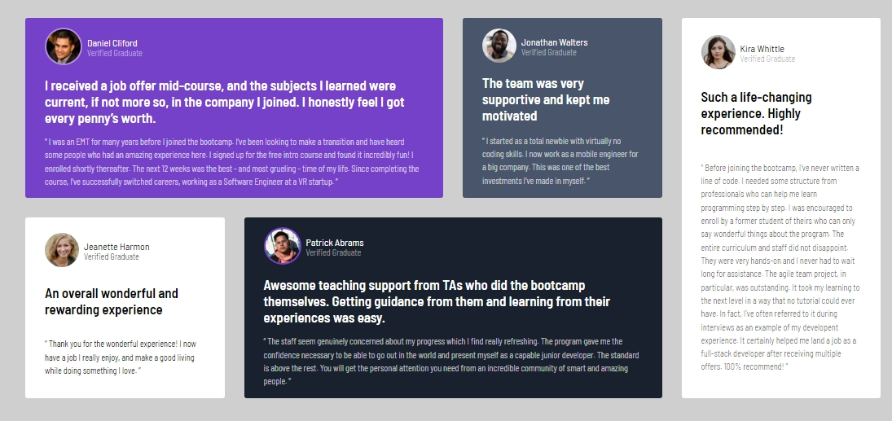

# Frontend Mentor - Testimonials grid section solution

This is a solution to the [Testimonials grid section challenge on Frontend Mentor](https://www.frontendmentor.io/challenges/testimonials-grid-section-Nnw6J7Un7). Frontend Mentor challenges help you improve your coding skills by building realistic projects. 

## Table of contents

- [Overview](#overview)
  - [The challenge](#the-challenge)
  - [Screenshot](#screenshot)
  - [Links](#links)
- [My process](#my-process)
  - [Built with](#built-with)
  - [What I learned](#what-i-learned)
  - [Continued development](#continued-development)

- [Author](#author)


## Overview

### The challenge

Users should be able to:

- View the optimal layout for the site depending on their device's screen size

### Screenshot




### Links

- Solution URL: [Add solution URL here](https://github.com/dimitrisdr/Testimonials-grid-section.git)
- Live Site URL: [Add live site URL here]( https://dimitrisdr.github.io/Testimonials-grid-section/)

## My process

### Built with

- Semantic HTML5 markup
- CSS custom properties
- Flexbox
- CSS Grid
- Mobile-first workflow


### What I learned

CSS-grid, grid-template-areas, better understanding of layouts

To see how you can add code snippets, see below:

```css
@media screen and (min-width:700px) {
    .wraper{
        max-width: 800px;
        margin-inline: 1rem;
    }

    .job-article {
       grid-area: job-span-2;
    }
    
    .team-article {
        grid-area: team;
    }
    
    .life-article {
        grid-area: life;
    }

    .experience-article {
       grid-area: exp;
    }
    
    .teaching-article {
        grid-area: teaching-span-2;
    }

    .wraper {
        grid-template-areas: 'job-span-2 job-span-2' 
                            'teaching-span-2 teaching-span-2'
                            'team life'
                            'exp life';
    }

}

@media screen and (min-width:1000px) {
    .wraper {
        max-width: 1400px;
        grid-auto-columns: 1fr;
        grid-template-areas: 'job-span-2 job-span-2 team life'
                            'exp teaching-span-2 teaching-span-2 life';
    }


     
}
```


## Author

- Frontend Mentor - [@dimitrisdr](https://www.frontendmentor.io/profile/dimitrisdr)

